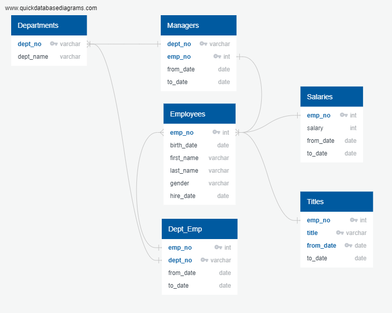

# Pewlett-Hackard-Analysis
Employee Database with SQL

## Overview
We embark in this project with the relational SQL database PostgreSQL to perform an analysis with our collaborator *Bobby* regarding a generation of retirement-ready employees of *Pewlett Hackard* (PH) -- a company with several tens of thousand employees that has been in existence for decades.  The forward-looking PH HR (Human Resources) department would like to prepare retirement packages for "silver tsunami" employees, as well as enable the company to continue to be successful in the near- and long-terms. 

With these goals in mind, the analysis is to be two-pronged:
1.  Determine employees (who?), titles (what? positions), and departments (where? and how many?) that will be affected and potentially in need of retirement support.
2.  Support development of programs, including one for mentorship, deemed necessary pending the specific results from Step one.

## Results
Now that analysis background has been determined, next is to dive right in to some preliminary findings, organized as follows:
> Deliverable 1 : The Number of Retiring Employees by Title
>>D-1A. Retirement Titles Table -- Current titles of *people* eligible to retire (i.e., Who?)

>>D-1B. Unique Titles -- *Most recent title* (for Retirement-eligible employees currently with PH) (i.e., What? positions)

>>D-1C. Retiring Titles -- *Number of titles* filled by employees who are retiring (i.e., How many?)

>. A total of  employees was found to be eligible for retirement, this is out of a total of current employees.

> Deliverable 2 : The Employees Eligible for the Mentorship Program
>>D-2. Mentorship Eligibility Table : 

## Summary
### Part I: Addressing Analysis
The questions of *Who? What (positions)? and How many (titles)?* have been addressed in the results section; one (mentioned in the overview) that remains to be addressed is *Where (i.e., which departments)?* as well as the finding and matching of mentors with those (eligible non-retiring current employees) who (potentially) will be mentored. The roles that will need to be filled (eligible retiring employees) is of greater number than those who are eligible to participate in the mentorship program as being mentored. Hence, as a concerned HR employee, Bobby will want to provide the departments, and especially those that will be most affected with a heads-up regarding titles and numbers of employees who are eligible to retire, and who may participate in the mentorship program.

As of now, this analysis has looked in to which departments (five of nine) currently are managed by "silver tsunami" retirement-eligible employees. This is summarized below: 
In the first image, the "Ret Mgr?" column denotes that the department has been managed by an employee who is eligible to retire. However, note that for three (yellow highlights) of the five departments ("Ret Mgr?" column  is "true") that have been managed by an employee now eligible for retirement, that employee no longer manages the department; two of the nine departments *currently* are managed by a retirement-eligible employee... 

This second image below shows all current department managers, with the "Ret Emp?" column showing the two departments -- d007 (Sales) and d008 (Research) -- *now* being managed by an employee who is eligible for retirement... 

>>(**prospective**). -- Look into departments where employees are retiring.

### Part II: Summing-up
>No matter how you pronounce it, as a word or as individual letters, SQL databases have utility, power, efficiency and speed to enable an analyst proficient with query language to perform insightful analyses, particularly for datasets that lend themselves to relational connections and where the inter-relationship of the data tables is well pictured with an ERDTable I (notes section below)relationship diagram.This capability (of relational databases) is accompanied by some caveats always to be mindful of when considering database tables:
>- "technical debt"see Notes section issue 1 
>- underlying assumptionssee Notes section issues 2 and 3 
>- potential data limitationssee Notes section issues 2 and 3 

> Meaningful analysis outcomes rely on always keeping these prior three issues in mind; at all steps make sure to keep checking that intermediate results make sense (e.g., via mental math for number of results returned, column types, ...).

---
### Notes:

#### Accompanying queries not depicted in images are in the "/Queries/Employee_Database_challenge.sql" file of this repository.

#### .CSV text files on which the "Results" deliverable snapshots are based are in the "/Data" folder of this repository.  

#### Current titles may be used to find positions that may need to be filled, perhaps from within the company; however, prior titles may be reviewed in order to determine whether employees previously holding positions may be able to mentor younger eligible non-retiring employees for those positions as well.

#### Three questions (Why?) tallied by Bobby during background set-up of database queries are discussed below.

Issues that may need to be looked into regarding database anomalies / weaknesses.

- **Issue 1**: Salaries in the salaries table look low relative to what currently may be expected.
> *Elaborating clarification*: Salaries table data may require updating; can check in to by looking at latest date which is Jan 31, 2001right image below.  Note that this being the case, the project may have been provided an out-of-date snapshot of salaries taken from an earlier time (e.g., maybe out of necessity, as something may have occurred to a more up-to-date file), or may need to notify source of underlying table of "technical debt" that may be incurred.reference Data Bootcamp recording from July 13, 2022

[][]

- **Issue 2**: It appears only five of nine departments have active managers.
> *Elaborating clarification*: Have to keep in mind underlying source of data being looked at; only considered managers coming from employees eligible to retire, so case may be that other four departments managed by employees not currently eligible for retirement package.Can see this by the query accompanying the first image in Part I of the Summary above.
[

- **Issue 3**: Some Department Retirees appear in table listing twice.
> *Elaborating clarification*: Those employees have changed positions during time employed at company. Can see this by query.see D-1A in deliverables above

Table 1: Project ERD (Entity Relationship Diagram).
- The inter-relationship of the data tables is well pictured with an ERD relationship diagram; for our initial purposes a program was recommended called QuickDBDMod. 7.1.4, an image from which is depicted below:

[

To accompany the image above, the following descriptive table is offeredformat as found in the Data Bootcamp website README.md file (updated by TA JCaro), in alphabetical order by "QuickDBD Table Name":

|QuickDBD Table Name|corresponding PostgreSQL DB Table Name|
|---|---|
|Departments|departments|
|Dept_Emp|dept_emp|
|Employees|employees|
|Managers|dept_manager|
|Salaries|salaries|
|Titles|titles|
